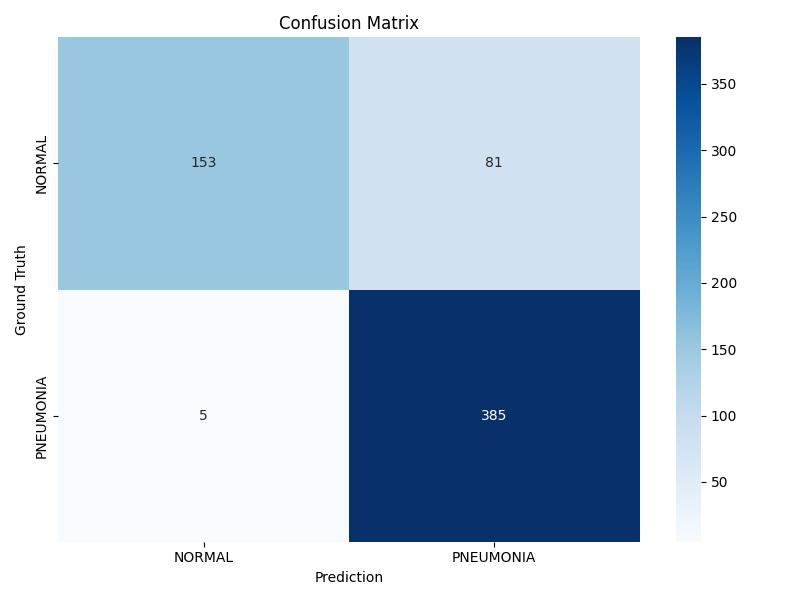
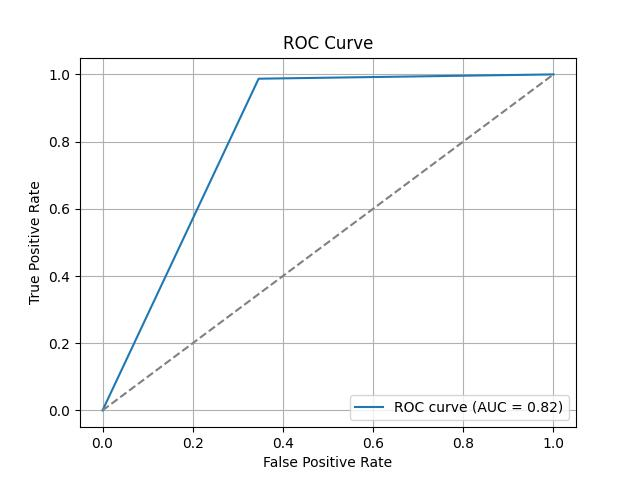

# Chest X-ray Pneumonia Classification
This project is a deep learning application for binary image classification of chest X-ray images to detect **pneumonia** using a fine-tuned **ResNet-50** model.

## Features
- Uses PyTorch and torchvision for model training

- Utilizes a pre-trained `ResNet-50` with ImageNet weights

- Logs training progress and saves best model

- Plots metrics like confusion matrix, ROC, and AUC

## Dataset
The dataset is sourced from [Chest X-Ray Images (Pneumonia)](<https://www.kaggle.com/datasets/paultimothymooney/chest-xray-pneumonia> "Title") dataset published by **Paul Mooney** on Kaggle. It contains two classes: **Normal** and **Pneumonia**. The number of images for each class is as follows:

<div align="center">

| Normal | Pneumonia |
|:----:|:----:|
|1583|4273|

</div>

Due to a significant class imbalance between the two categories, manual undersampling was performed. The final number of images used for **training**, **validation**, and **testing** is summarized below:

<div align="center">

| |Normal|Pneumonia|
|:----     |:----:|:----:   |
|Training  |1199  |1218     |
|Validation|150   |135      |
|Testing   |234   |390

</div>

## Evaluation
### Classification Report (Precision, Recall, F1)

<div align="center">

|          |Precision|Recall  |F1-score|
|:----     |:----:   |:----:  |:---:|
|Normal    |0.968    |0.654   |0.781|
|Pneumonia |0.826    |0.987   |0.899|

</div>

- **Precision**:

    - Normal: 96.8% → A very high proportion of predictions classified as Normal are correct.

    - Pneumonia: 82.6% → There are still misclassifications when predicting Pneumonia (such as incorrectly classifying Normal as Pneumonia).

- **Recall**:

    - Normal: 65.4% → The model only captures approximately 2/3 of normal images, requiring further investigation and improvement.

    - Pneumonia: 98.7% → Almost all pneumonia cases can be successfully detected.

- **F1-score**:

    - Pneumonia has a higher F1 score than Normal, indicating the model has stronger ability to distinguish Pneumonia class.

### Confusion Matrix
Based on the Confusion Matrix, it can be observed that the model is very sensitive to pneumonia identification (missing only 5 images), but has more misclassifications for normal images (81 images were misclassified as pneumonia).



### ROC Curve and AUC
The AUC (Area Under Curve) is 0.82, indicating that the overall classification ability is reasonably acceptable.



## Requirements
See ```requirements.txt``` for Python package dependencies.

```python
pip install -r requirements.txt
```

## Contact
If you have any questions or suggestions, feel free to submit an Issue or a Pull Request!
